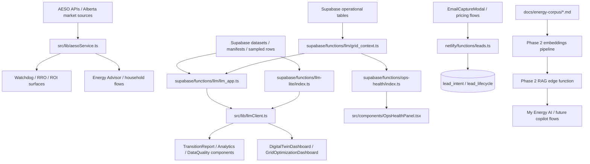

# Data Lineage Map

## Purpose
This document is the lightweight lineage layer for CEIP's highest-value flows. It is intended to replace heavyweight metadata tooling until live ingestion and transformation layers justify more infrastructure.

## Mermaid Overview

## Key Flows

### 1. Alberta pricing and consumer surfaces
- Source family: AESO and Alberta market-rate references
- Main code path: `src/lib/aesoService.ts`
- Main product surfaces: Rate Watchdog, RRO comparison, ROI-oriented flows, household advisory experiences
- Current risk: mixed live/cached/fallback behavior still needs broader freshness labeling across UI surfaces

### 2. LLM insight generation
- Source family: Supabase manifests, sampled dataset rows, grid context
- Main code path: `supabase/functions/llm/llm_app.ts` and `supabase/functions/llm-lite/index.ts`
- Client bridge: `src/lib/llmClient.ts`
- Main product surfaces: transition reporting, data quality, analytics insight, grid optimization
- Current risk: AI quality depends on sampled rows and prompt quality; Phase 2 corpus/RAG work is still pending

### 3. Operational health and freshness
- Source family: Supabase operational tables and heartbeat/freshness checks
- Main code path: `supabase/functions/ops-health/index.ts`
- UI surface: `src/components/OpsHealthPanel.tsx`
- Current risk: freshness transparency exists, but the contract is not yet universal across every user-facing response

### 4. Lead lifecycle capture
- Source family: checkout and pricing-intent interactions
- Main code path: `src/components/billing/EmailCaptureModal.tsx` -> `netlify/functions/leads.ts`
- Persistence layer: `lead_intent`, `lead_lifecycle`, `lead_nurture_log`
- Current risk: downstream lifecycle analytics and nurture automation remain future work

## Next Lineage Expansions
- AESO/IESO ingestion cron tables after Phase 3 implementation
- future embedding/chunk tables after pgvector enablement
- asset-health export lineage into regulatory filing surfaces
- prompt-template lineage for each LLM endpoint
