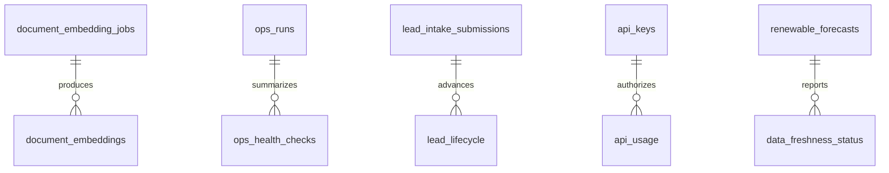

# Schema Overview

This document captures the major tables and relationships that matter for the current CEIP implementation.
It is intentionally selective: the repo already has enough migrations to discover the full database, but the product only needs a concise operational map here.

## High-Value Tables

### Provenance and freshness
- `data_freshness_status`
- `api_usage`
- `ops_runs`
- `ops_health_checks`

### RAG and corpus
- `document_embeddings`
- `document_embedding_jobs`

### Alberta and Ontario operational data
- `aeso_pool_prices`
- `aeso_generation_mix`
- `ieso_daily_summary`
- `ieso_interconnection_queue`
- `provincial_generation`
- `renewable_forecasts`

### Leads and monetization
- `lead_intake_submissions`
- `lead_lifecycle`
- `lead_nurture_log`
- `api_keys`

## Relationships

## Operational Rules
- Tables that feed public dashboards should expose freshness metadata or a documented fallback path.
- Tables used by the RAG flow should retain `source_id`, `chunk_index`, and source URLs where possible.
- Forecast and market tables should keep the distinction between live observations, snapshots, and synthetic fallbacks explicit.

## Next Work
- Expand this document when the missing ingestion workflows are added.
- Promote the RAG and ingestion schemas into a more detailed reference only after they become stable.
