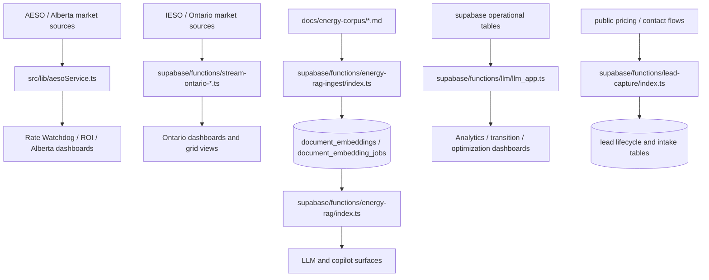

# Data Lineage

This is the lightweight, human-readable lineage view for the CEIP codebase.
It intentionally tracks the highest-value source-to-surface paths without requiring heavyweight metadata tooling.

## Core Lineage

## Notes
- `source`, `last_updated`, `freshness_status`, and `is_fallback` are the shared contract for high-risk live-data surfaces.
- Seed corpus documents are deliberately short and source-anchored so future RAG ingestion can keep provenance stable.
- The layout is intentionally smaller than a full data-catalog tool; the repo does not yet justify that overhead.

## Next Expansion
- Add AESO/IESO/ECCC ingestion tables to this map as Phase 3 matures.
- Add more corpus documents as the curated set grows.
- Expand this document only when the lineage changes materially for a user-facing flow.
